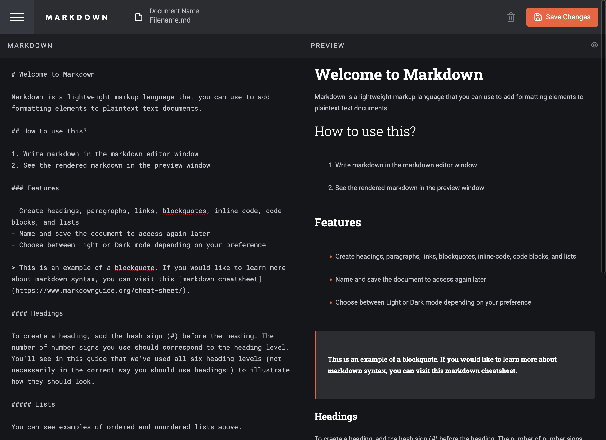

# Frontend Mentor - In-browser markdown editor solution

This is a solution to the [In-browser markdown editor challenge on Frontend Mentor](https://www.frontendmentor.io/challenges/inbrowser-markdown-editor-r16TrrQX9). Frontend Mentor challenges help you improve your coding skills by building realistic projects. 

## Table of contents

- [Overview](#overview)
  - [The challenge](#the-challenge)
  - [Screenshot](#screenshot)
  - [Links](#links)
- [My process](#my-process)
  - [Built with](#built-with)
  - [What I learned](#what-i-learned)
  - [What's Next?](#future-development)
  - [Useful resources](#useful-resources)
- [Author](#author)

## Overview

### The challenge

Users should be able to:

- Create, Read, Update, and Delete markdown documents
- Name and save documents to be accessed as needed
- Edit the markdown of a document and see the formatted preview of the content
- View a full-page preview of the formatted content
- View the optimal layout for the app depending on their device's screen size
- See hover states for all interactive elements on the page

### Screenshot



### Links

- Solution URL: [Github Repo](https://github.com/NotKijana/markdown-editor/)
- Live Site URL: [Markdown Editor](https://notkijana.github.io/markdown-editor/) 
## My process

### Built with

- Jsx
- Custom CSS
- Flexbox
- CSS Grid
- Desktop-first workflow
- [React](https://reactjs.org/) - JS library
- React Hooks (Context, useState, useRef, etc)
- [ReactMarkdown](https://www.npmjs.com/package/react-markdown) - React Component

### What I learned

I learned a lot about breaking a project down into smaller parts in order to give each section the attention to detail it deserves. I also was able to practice a lot of the React hooks that at first intimated me, but now I feel confident when using them. And finally, I really was able to hone in on minimizing my CSS as much as I could, so that when I use scss I can benefit from it's features more.

Some code snippets I am particularly happy with include:

```css
.layout {
  position: relative;
  display: flex;
  flex-flow: column;
  min-height: 100vh;
  background: #151619;
}
```

```jsx
props.input
  ? <input id='fileInput' onChange={e => setFile(e.target.value)} type='text' value={file} />
  : props.filename
```

```jsx
<Header name='PREVIEW' onClick={onClick} image={setPreviewEye()} />
```

### Future Development

I plan on refactoring this mockup into a fullstack application. I would like to add additional features to make creating markdown files significantly easier. A few aesthetic changes will be made as well.

### Useful resources

- [Conditional Rendering based on screen dimensions](https://stackoverflow.com/questions/36862334/get-viewport-window-height-in-reactjs) - This helped me to better understand how to implement a responsive application without needing to add additional classes based to be used. I will definitely be implementing variations of this to future projects.
- [Dynamic Theming](https://www.section.io/engineering-education/watch-for-system-dark-mode-using-js-css/) - This is an amazing article that I reference whenever I need to add user-preferred theming to my project. It is easy to follow and implement in React.

## Author

- [Not My Site](https://www.kijana.io)
- Frontend Mentor - [@NotKijana](https://www.frontendmentor.io/profile/NotKijana)
- [Not Kijana's Github](https://www.twitter.com/yourusername)